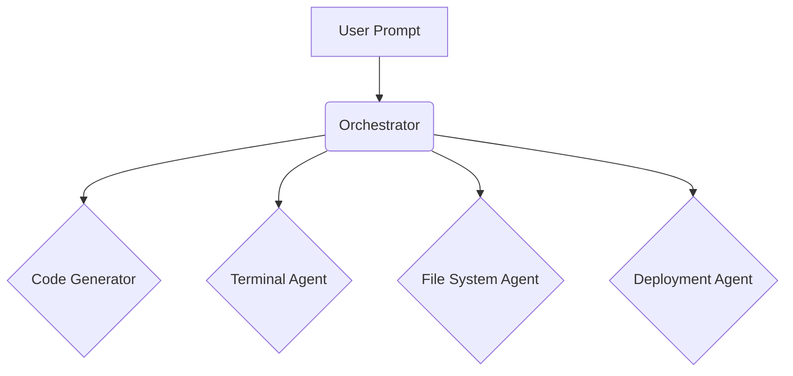

<!-- AGENTS.md instructions:
- Follow .github/copilot-instructions.md for complete development guidelines
- Access AI SDK at https://sdk.vercel.ai/llms.txt
- Follow https://webcontainer-tutorial.pages.dev/
- Follow https://webcontainers.io/api
- Make sure to follow .github/remix.md
-->

<div align="center">
  
  <h1>xCoder</h1>
  <p><b>An AI-powered web development agent that allows you to prompt, run, edit, and deploy full-stack applications directly from your browser—no local setup required.</b></p>

  <p>
    <a href="https://github.com/likhon29jan/xCoder/stargazers"></a>
    <a href="https://github.com/likhon29jan/xCoder/forks"></a>
    <a href="https://github.com/likhon29jan/xCoder/watchers"></a>
  </p>

  <p>
    <a href="https://github.com/likhon29jan/xCoder/issues"></a>
    <a href="https://github.com/likhon29jan/xCoder/pulls"></a>
    <a href="https://github.com/likhon29jan/xCoder/blob/main/LICENSE"></a>
  </p>
</div>

## ✨ What is xCoder?

xCoder is an AI-powered web development agent that allows you to prompt, run, edit, and deploy full-stack applications directly from your browser—no local setup required.

### 🚀 The Magic Behind xCoder

- **Full-Stack in the Browser**: xCoder integrates cutting-edge AI models with an in-browser development environment powered by StackBlitz’s WebContainers.
- **AI with Environment Control**: Unlike traditional dev environments, xCoder gives AI models complete control over the entire environment, including the filesystem, node server, package manager, terminal, and browser console.

### 🤔 Why xCoder?

| Feature | Traditional Development | xCoder |
| --- | --- | --- |
| **Setup** | Manual, time-consuming | Instant, in-browser |
| **Environment** | Local machine dependent | Consistent, reproducible |
| **AI Assistance** | Code generation only | Full environment control |
| **Deployment** | Manual process | One-click from chat |
| **Collaboration** | Git, PRs, etc. | Shareable URL |

---

## 🎨 Features

- **🤖 AI-Powered Development**: Generate, edit, and deploy code with natural language prompts.
- **🌐 Full-Stack Support**: Works with Node.js, Vite, Next.js, and more.
- **📦 Integrated Terminal**: Run any command, just like your local terminal.
- **📄 File System Access**: Create, read, update, and delete files and folders.
- **🚀 One-Click Deployment**: Deploy your applications to Vercel or Netlify.
- **🔗 Shareable Workspaces**: Share your entire development environment with a single URL.

---

## 🚀 Getting Started

1.  **Install dependencies:**
    ```bash
    pnpm install
    ```

2.  **Run the development server:**
    ```bash
    pnpm dev
    ```

This will start the Remix development server. View the application in your browser at the address provided.

---

## ⚙️ How It Works

xCoder uses a multi-agent architecture to handle various aspects of the development process.



- **Orchestrator**: Routes requests to the appropriate specialist agent.
- **Code Generator**: Generates code based on user prompts.
- **Terminal Agent**: Executes commands in the WebContainer.
- **File System Agent**: Handles all file operations.
- **Deployment Agent**: Deploys applications to Vercel or Netlify.

---

## 📝 Quick Examples

Here are a few examples of how you can interact with xCoder:

**Example 1: Create a new React component**

> **You:** "Create a new React component called `Button` with a blue background."
>
> **xCoder:** "Done. I've created `src/components/Button.tsx` and added the basic component structure with styling."

**Example 2: Install a new dependency**

> **You:** "Install `axios` and add it to the project."
>
> **xCoder:** "Okay, I've installed `axios` and added it to your `package.json`."

---

## 📁 Project Structure

```
.
├── app/
├── src/
│   └── agents/
│       ├── orchestrator.ts
│       ├── code-generator.ts
│       ├── terminal.ts
│       ├── filesystem.ts
│       └── deployment.ts
├── .gitignore
├── AGENTS.md
├── README.md
├── package.json
└── tsconfig.json
```

---

## 💻 Development

- **Install dependencies**: `pnpm install`
- **Start dev server**: `pnpm dev`
- **Build for production**: `pnpm build`
- **Run tests**: `pnpm test`
- **Type check**: `pnpm typecheck`
- **Lint code**: `pnpm lint`

---

## 🤝 Contributing

Contributions are welcome! Please follow these steps to contribute:

1. Fork the repository.
2. Create a new branch (`git checkout -b feature/your-feature`).
3. Make your changes.
4. Commit your changes (`git commit -m 'Add some feature'`).
5. Push to the branch (`git push origin feature/your-feature`).
6. Open a pull request.

---

## 📜 License

This project is licensed under the MIT License - see the [LICENSE](LICENSE) file for details.

---

## 💖 Acknowledgments

- [StackBlitz WebContainers](https://webcontainers.io/)
- [Vercel AI SDK](https://sdk.vercel.ai/)
- [Remix](https://remix.run/)

---

## 🗺️ Roadmap

- **Q4 2025**:
  - [ ] Advanced AI-powered debugging
  - [ ] Support for more deployment targets
  - [ ] Real-time collaboration features

---

## 💬 Community

- [Join our Discord](httpsTBD)
- [Follow us on Twitter](TBD)

---

Last updated: 2025-10-16